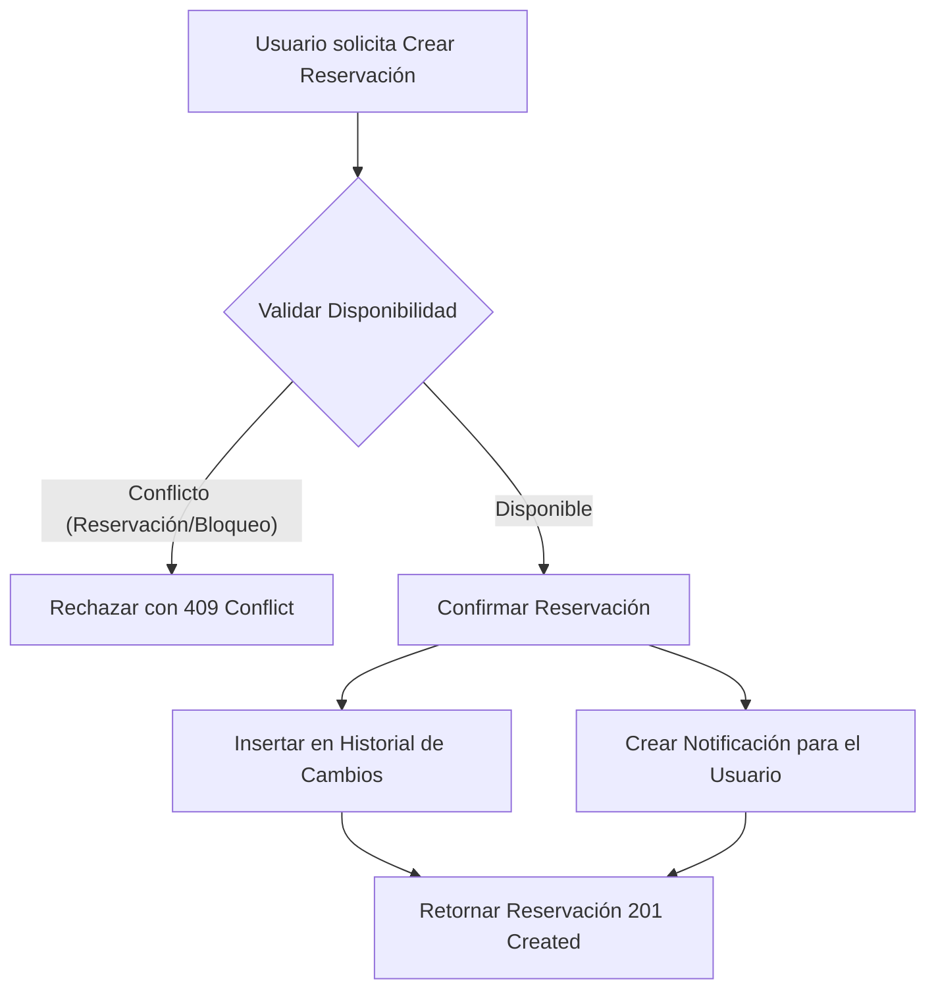

# Módulo de Reservaciones

## Flujo Completo



1. **Crear**: El usuario envía los datos para una nueva reservación.
2. **Validar Disponibilidad**: El sistema verifica que no existan conflictos con otras reservaciones (no canceladas) ni horarios bloqueados para el espacio solicitado.
3. **Confirmar**: Se crea la reservación con estado 'pendiente'.
4. **Historial**: Se inserta un registro en el historial de cambios indicando la creación.
5. **Notificación**: Se genera una notificación para el usuario confirmando la creación.

## Endpoints

### 1. Obtener todas las reservaciones (Admin)
`GET /api/reservaciones`

**Request:**
- Headers: `Authorization: Bearer <token>` (Rol requerido: admin)

**Response (200 OK):**
```json
[
  {
    "id": 1,
    "usuario_id": 2,
    "espacio_id": 1,
    "fecha_inicio": "2026-06-01T10:00:00.000Z",
    "fecha_fin": "2026-06-01T12:00:00.000Z",
    "estado": "pendiente",
    "motivo": "Reunión de equipo",
    "created_at": "2026-05-05T10:00:00.000Z",
    "usuario_nombre": "Juan Pérez",
    "espacio_nombre": "Sala de Juntas A"
  }
]
```

### 2. Obtener mis reservaciones
`GET /api/reservaciones/mis-reservaciones`

**Request:**
- Headers: `Authorization: Bearer <token>`

**Response (200 OK):**
```json
[
  {
    "id": 1,
    "usuario_id": 2,
    "espacio_id": 1,
    "fecha_inicio": "2026-06-01T10:00:00.000Z",
    "fecha_fin": "2026-06-01T12:00:00.000Z",
    "estado": "pendiente",
    "motivo": "Reunión de equipo",
    "created_at": "2026-05-05T10:00:00.000Z",
    "usuario_nombre": "Juan Pérez",
    "espacio_nombre": "Sala de Juntas A"
  }
]
```

### 3. Obtener detalle de reservación
`GET /api/reservaciones/:id`

**Request:**
- Headers: `Authorization: Bearer <token>` (Debe ser el dueño o admin)

**Response (200 OK):**
```json
{
  "id": 1,
  "usuario_id": 2,
  "espacio_id": 1,
  "fecha_inicio": "2026-06-01T10:00:00.000Z",
  "fecha_fin": "2026-06-01T12:00:00.000Z",
  "estado": "pendiente",
  "motivo": "Reunión de equipo",
  "created_at": "2026-05-05T10:00:00.000Z",
  "usuario_nombre": "Juan Pérez",
  "espacio_nombre": "Sala de Juntas A"
}
```

### 4. Crear Reservación
`POST /api/reservaciones`

**Request:**
- Headers: `Authorization: Bearer <token>`
- Body:
```json
{
  "espacio_id": 1,
  "fecha_inicio": "2026-06-01T10:00:00",
  "fecha_fin": "2026-06-01T12:00:00",
  "motivo": "Reunión de equipo"
}
```

**Response (201 Created):**
```json
{
  "id": 1,
  "usuario_id": 2,
  "espacio_id": 1,
  "fecha_inicio": "2026-06-01T10:00:00.000Z",
  "fecha_fin": "2026-06-01T12:00:00.000Z",
  "estado": "pendiente",
  "motivo": "Reunión de equipo",
  "created_at": "2026-05-05T10:00:00.000Z"
}
```

### 5. Modificar Reservación
`PUT /api/reservaciones/:id`

**Request:**
- Headers: `Authorization: Bearer <token>` (Debe ser el dueño o admin)
- Body:
```json
{
  "fecha_inicio": "2026-06-01T11:00:00",
  "fecha_fin": "2026-06-01T13:00:00",
  "motivo": "Cambio de hora"
}
```

**Response (200 OK):**
```json
{
  "id": 1,
  "usuario_id": 2,
  "espacio_id": 1,
  "fecha_inicio": "2026-06-01T11:00:00.000Z",
  "fecha_fin": "2026-06-01T13:00:00.000Z",
  "estado": "pendiente",
  "motivo": "Cambio de hora",
  "created_at": "2026-05-05T10:00:00.000Z"
}
```

### 6. Cancelar Reservación
`PATCH /api/reservaciones/:id/cancelar`

**Request:**
- Headers: `Authorization: Bearer <token>` (Debe ser el dueño o admin)

**Response (200 OK):**
```json
{
  "id": 1,
  "usuario_id": 2,
  "espacio_id": 1,
  "fecha_inicio": "2026-06-01T10:00:00.000Z",
  "fecha_fin": "2026-06-01T12:00:00.000Z",
  "estado": "cancelada",
  "motivo": "Reunión de equipo",
  "created_at": "2026-05-05T10:00:00.000Z"
}
```
